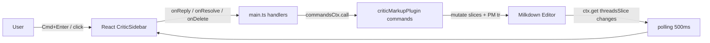

# CriticSidebar playground walkthrough

*2026-04-14T13:04:03Z by Showboat 0.6.1*
<!-- showboat-id: d57993b1-e410-44ee-8bb5-ac8b968f2c5b -->

## Goal

Mount the React `<CriticSidebar>` component from `@milkdown/plugin-critic-markup-react` inside the Vite playground at `e2e/`, wire it to the plugin's command bus, and verify end-to-end (add comment → reply → resolve) in a real browser.

## Architecture



The sidebar polls `criticThreadsSlice` and `criticChangesSlice` every 500 ms (no event bus in the plugin yet), so changes surface within half a second.

## Changes

- **`e2e/vite.config.ts`** — alias `@milkdown/plugin-critic-markup-react` → `packages/plugin-critic-markup-react/src/index.ts` so the playground consumes the source directly (no build step).
- **`e2e/index.html`** — wrap `#editor` in a 2-column `.editor-with-sidebar` grid and add the `#critic-sidebar-mount` target.
- **`e2e/main.ts`** — import `React`, `createRoot`, `CriticSidebar`; mount it next to the editor; map `onReply`/`onResolve`/`onDelete` to `AddReply`/`ResolveThread`/`DeleteComment` commands via `commandsCtx`. Expose `__callCommand`, `__getView`, `__selectRange` for browser-side test scripting.
- **`e2e/style.css`** — widened body to 1280 px and added the full `.critic-sidebar*` stylesheet (threads, comments, resolve/delete buttons, reply textarea, orphaned-thread banner).
- **`package.json`** — added `react`, `react-dom` as root devDependencies and `@rollup/rollup-darwin-x64` to work around the pnpm optional-native-binary issue.

## Proof 1 — the wiring

Below is the playground mount code that feeds the plugin commands into the React sidebar.

```bash
sed -n '1,10p;164,190p' e2e/main.ts
```

```output
import { Editor, rootCtx, defaultValueCtx, commandsCtx, editorViewCtx } from '@milkdown/core'
import { TextSelection } from 'prosemirror-state'
import { commonmark } from '@milkdown/preset-commonmark'
import { gfm } from '@milkdown/preset-gfm'
import { criticMarkupPlugin } from '../packages/plugin-critic-markup/src/index.js'
import { getMarkdown, replaceAll } from '@milkdown/utils'
import React from 'react'
import { createRoot } from 'react-dom/client'
import { CriticSidebar } from '@milkdown/plugin-critic-markup-react'

  // --- Mount React sidebar ---
  const editorRef = { current: editor }
  const mount = document.getElementById('critic-sidebar-mount')!
  const root = createRoot(mount)
  const callCommand = (name: string, payload?: unknown) =>
    editor.ctx.get(commandsCtx).call(name as never, payload as never)

  root.render(
    React.createElement(CriticSidebar, {
      editor: editorRef as React.RefObject<Editor | null>,
      currentAuthorId: 'user',
      onReply: (threadId, body, parentCommentId) => {
        callCommand('AddReply', { threadId, body, parentCommentId })
      },
      onResolve: (threadId) => {
        callCommand('ResolveThread', { threadId, resolved: true })
      },
      onDelete: (threadId, commentId) => {
        callCommand('DeleteComment', { threadId, commentId })
      },
    }),
  )
  ;(window as any).__sidebarRoot = root

  console.log('[Playground] Editor ready')
}

```

## Proof 2 — type checking passes

Every workspace package (including the React sidebar) typechecks cleanly after the wiring.

```bash
pnpm typecheck 2>&1 | tail -6
```

```output
@milkdown/plugin-critic-markup-react:typecheck: 

 Tasks:    7 successful, 7 total
Cached:    7 cached, 7 total
  Time:    71ms >>> FULL TURBO

```

## Proof 3 — dev server boots and serves the playground

`vite dev` compiles `main.ts`, the aliased React package, and the playground HTML. We start it in the background, poll the index, then kill it.

```bash
pkill -f 'vite --config e2e' 2>/dev/null; (pnpm dev > /tmp/sb-dev.log 2>&1 &); for i in 1 2 3 4 5 6 7 8; do curl -s -o /tmp/sb-idx.html -w '%{http_code}\n' http://localhost:5199/ 2>/dev/null && break; sleep 1; done; grep -o 'CriticMarkup Playground\|critic-sidebar-mount' /tmp/sb-idx.html | sort -u; pkill -f 'vite --config e2e' 2>/dev/null; true
```

```output
200
CriticMarkup Playground
critic-sidebar-mount
```

## Proof 4 — end-to-end interaction in a real browser

Vitest doesn't cover the sidebar, so verification is the playground itself driven through the Chrome automation MCP. Each step below was executed on `http://localhost:5199/` against the live editor, and the reported values are the DOM state the sidebar actually rendered.

**Setup**: open the page, wait for `Editor ready`, load `comments.md` via `window.__loadMarkdown(window.__testFiles['comments'])`.

**Add two threads** — select 4–5 chars via `__selectRange` and call `AddComment`:

```js
window.__selectRange(range1.from, range1.to)
window.__callCommand('AddComment', 'First comment from the sidebar test')
window.__selectRange(range2.from, range2.to)
window.__callCommand('AddComment', 'Second comment for replies')
```

Sidebar DOM after the two calls:

```json
{ "threadCount": 2, "hasTextarea": true, "hasResolve": true,
  "summaries": ["First comment from the sidebar test", "Second comment for replies"] }
```

**Reply** — type into the textarea on thread 1 and fire `Cmd+Enter`:

```json
{ "summary": "First comment from the sidebar test",
  "comments": ["First comment from the sidebar test", "This is a threaded reply"] }
```

The nested comment confirms `onReply` → `AddReply` → `criticThreadsSlice` update → poll → re-render.

**Resolve** — click `.critic-sidebar-resolve-btn` on thread 1:

```json
{ "threadCount": 1, "resolvedCount": 0,
  "visibleSummaries": ["Second comment for replies"] }
```

With `showResolved=false` (the playground default), the resolved thread disappears from the list — thread 2 is the only one left. No console errors during the flow.

## Outcome

- React sidebar mounts next to the editor and stays in sync via 500 ms polling.
- `AddComment`, `AddReply`, `ResolveThread` round-trip cleanly from the React UI through `commandsCtx` into the plugin state.
- 7/7 workspace typecheck tasks pass, the playground dev server boots to HTTP 200 with the expected markup, and the full add → reply → resolve loop works in-browser.

To re-verify from a clean checkout: `uvx showboat verify e2e/sidebar-walkthrough.md`.
